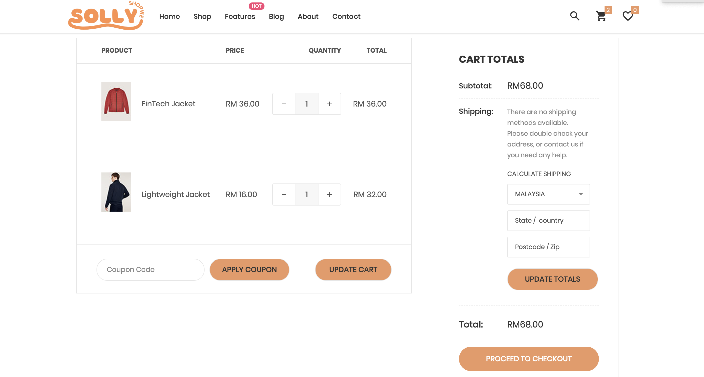
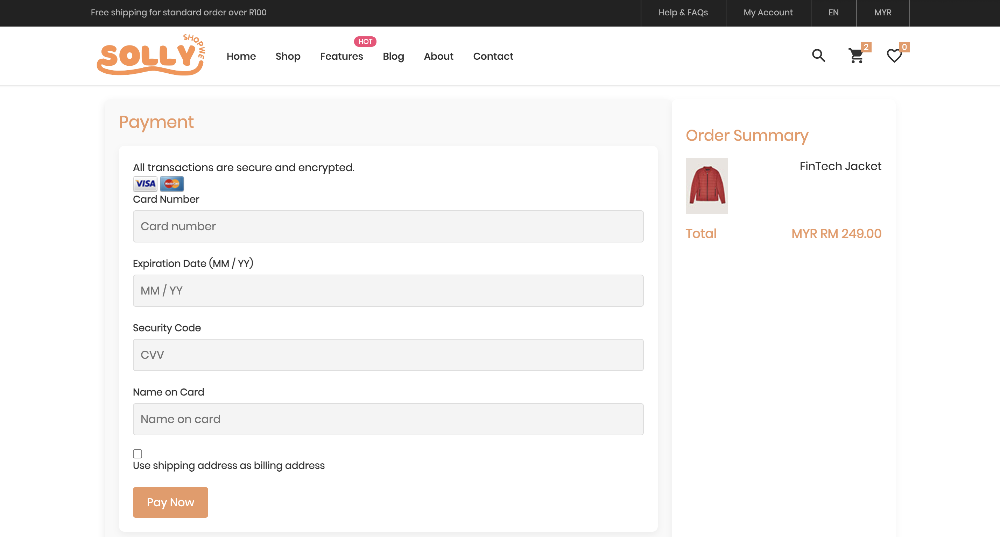

# Solly Shop

**Group Name:** Group B

**Title of the project:** Solly Shop

**Section:** 01 

**Team Mates:**

1.Muhammad Hafiz Firdaus Bin Mohammad Anuar (2214725)

2.Nur Qistina Aliesa Binti Yulfa Andri (2215272)

3.Nik Hajar Aisyah Binti Nik Anuar (2224606)

4.Nurlyana Izzati Binti Rahmat (2227066)

5.Nurizzati Insyirah Binti Mohd Nazim (2227224)

## Introduction

## Objective
The main goal of the suggested web application is to develop a straightforward and effective online shopping platform that allows customers to explore, choose, and buy products effortlessly. The purpose of the application is to deliver:

Effortless User Experience: An adaptable and user-friendly interface that guarantees fluid navigation between categories, comprehensive product displays, and efficient checkout procedures.

Safe Transactions: Strong payment gateway connections to ensure secure and dependable online transactions.

Support Sellers: Provide tools to manage products, track sales, and promote their business

Thorough Product Administration: An internal system for effectively handling inventory, orders, and customer information.

Accessibility: A design optimized for mobile use to engage a wider audience and guarantee usability across different devices.

This online platform seeks to connect sellers with buyers, establishing a digital marketplace that promotes ease, reliability, and interaction for everyone involved.

## Features and functionalities

**Homepage**

**Catalog**

User browse product

**Product Details**

User can see the product details, and select their eg:size,color according to their preferences.

**Shopping Cart and Checkout**

User can add products to their cart, add quantity, and enter their shipping address before doing payment.

**Payment**

User make secure payments.

## ERD

## Sequence Diagram

## References

