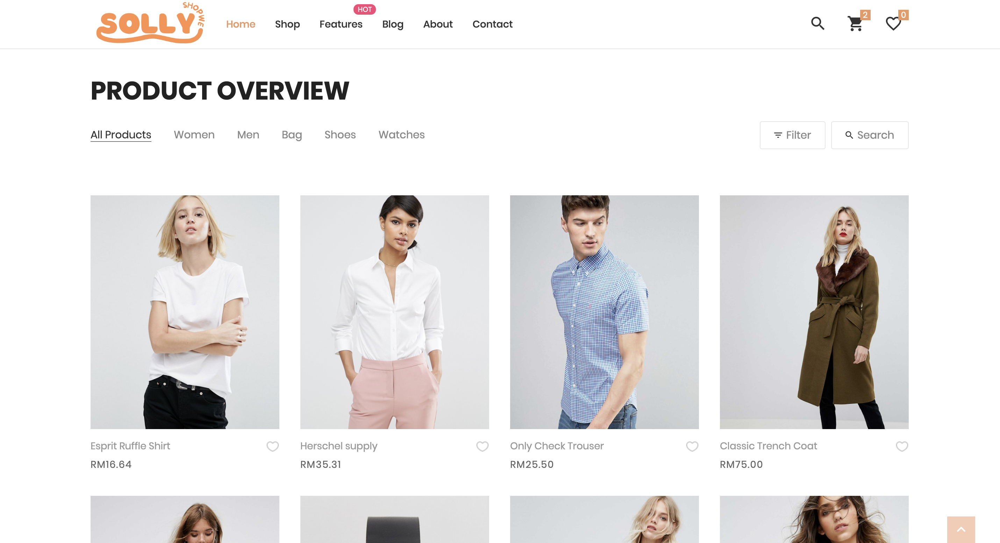
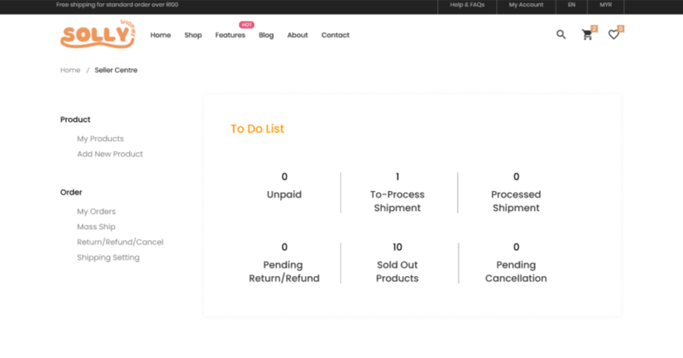
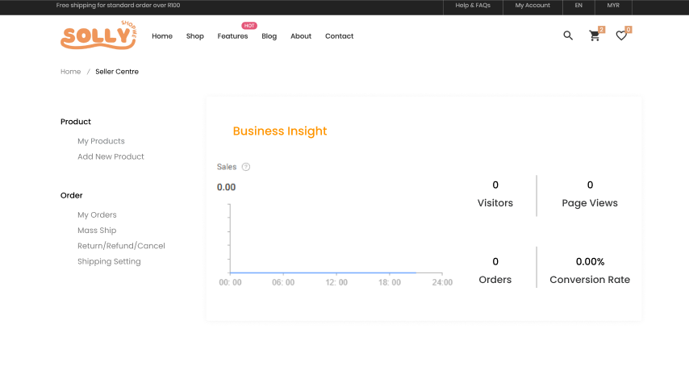

# Solly Shop

**Group Name:** Group B

**Title of the project:** Solly Shop

**Section:** 01 

**Team Mates:**

1.Muhammad Hafiz Firdaus Bin Mohammad Anuar (2214725)

2.Nur Qistina Aliesa Binti Yulfa Andri (2215272)

3.Nik Hajar Aisyah Binti Nik Anuar (2224606)

4.Nurlyana Izzati Binti Rahmat (2227066)

5.Nurizzati Insyirah Binti Mohd Nazim (2227224)

## Introduction
Online markets have become a popular way for people to buy and sell products. Creating a web application for an online market means building a website where users can easily browse, purchase, and sell items. It combines good design, useful features, and secure technology to make the shopping experience smooth and trustworthy.

A basic online market web application usually includes features like user accounts, product categories, a shopping cart, and secure payment options. Other helpful features like search filters, and order tracking can make the platform more user-friendly.

This guide will walk you through the steps needed to bring Solly Shop to life, from planning and designing to building and launching it. Whether you’re starting a new project or learning something new, this introduction will help you understand how to create a functional and easy-to-use online marketplace.

## Objective
The main goal of the suggested web application is to develop a straightforward and effective online shopping platform that allows customers to explore, choose, and buy products effortlessly. The purpose of the application is to deliver:

Effortless User Experience: An adaptable and user-friendly interface that guarantees fluid navigation between categories, comprehensive product displays, and efficient checkout procedures.

Safe Transactions: Strong payment gateway connections to ensure secure and dependable online transactions.

Support Sellers: Provide tools to manage products, track sales, and promote their business

Thorough Product Administration: An internal system for effectively handling inventory, orders, and customer information.

Accessibility: A design optimized for mobile use to engage a wider audience and guarantee usability across different devices.

This online platform seeks to connect sellers with buyers, establishing a digital marketplace that promotes ease, reliability, and interaction for everyone involved.

## Features and functionalities

**Create Account**

**Login Page**

**Homepage**

**Catalog**

User browse product

**Product Details**

User can see the product details, and select their eg:size,color according to their preferences.

**Shopping Cart and Checkout**

User can add products to their cart, add quantity, and enter their shipping address before doing payment.

**Payment**

User make secure payments.

**User account**

User manage their account.

**Order**

User left reviews and ratings for their orders.

**Tracking**

User can click on the tracking button to track their order

**Management**

Admin track and manage customers orders.

## ERD

## Sequence Diagram

## References

