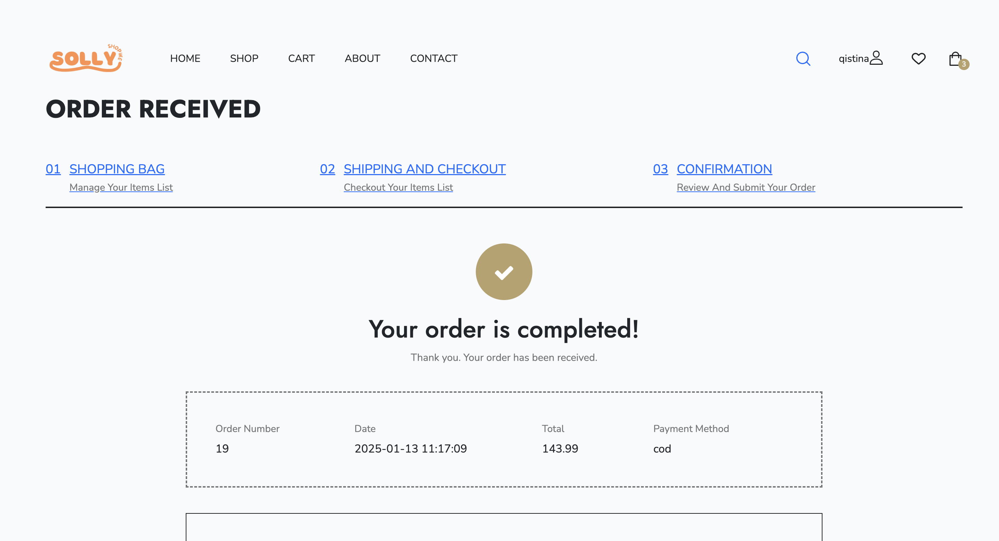

# Solly Shop

**Group Name:** Group B

**Title of the project:** Solly Shop

**Section:** 01

**Team Mates:**

1.Mohammad Hafiz Firdaus Bin Mohammad Anuar (2214725)

2.Nur Qistina Aliesa Binti Yulfa Andri (2215272)

3.Nik Hajar Aisyah Binti Nik Anuar (2224606)

4.Nurlyana Izzati Binti Rahmat (2227066)

5.Nurizzati Insyirah Binti Mohd Nazim (2227224)

## Introduction
Online markets have become a popular way for people to buy and sell products. Creating a web application for an online market means building a website where users can easily browse, purchase, and sell items. It combines good design, useful features, and secure technology to make the shopping experience smooth and trustworthy.

A basic online market web application usually includes features like user accounts, product categories, a shopping cart, and secure payment options. Other helpful features like search filters, and order tracking can make the platform more user-friendly.

This guide will walk you through the steps needed to bring Solly Shop to life, from planning and designing to building and launching it. Whether you’re starting a new project or learning something new, this introduction will help you understand how to create a functional and easy-to-use online marketplace.

## Objective
The main goal of the suggested web application is to develop a straightforward and effective online shopping platform that allows customers to explore, choose, and buy products effortlessly. The purpose of the application is to deliver:

Effortless User Experience: An adaptable and user-friendly interface that guarantees fluid navigation between categories, comprehensive product displays, and efficient checkout procedures.

Safe Transactions: Strong payment gateway connections to ensure secure and dependable online transactions.

Support Sellers: Provide tools to manage products, track sales, and promote their business

Thorough Product Administration: An internal system for effectively handling inventory, orders, and customer information.

Accessibility: A design optimized for mobile use to engage a wider audience and guarantee usability across different devices.

This online platform seeks to connect sellers with buyers, establishing a digital marketplace that promotes ease, reliability, and interaction for everyone involved.

## Features and functionalities

**Create Account**

**Login Page**

**Homepage**

**Catalog**

User browse product

**Product Details**

User can see the product details, and select their eg:size,color according to their preferences.

**Shopping Cart and Checkout**

User can add products to their cart, add quantity, and enter their shipping address before doing payment.

**Payment**

User make secure payments.

**User account**

User manage their account.

**Order**

User left reviews and ratings for their orders.

**Tracking**

User can click on the tracking button to track their order

**Management**

Seller track and manage customers orders.

**Seller**

My Order(Seller)

Seller can track their customer orders.

Mass Ship

Sellers can view the status of their bulk shipments on this page to manage orders and arrange deliveries. Once the buyer confirms receipt of the order, the confirmation will be visible here.

Add New Product(Seller)

Seller adds new product.

Return and Refund (seller)

Seller can view the buyer's return and refund request and take action.

## ERD

## Sequence Diagram

# FINAL REPORT

## Project system captured screen and explanation
### Customer

**Homepage**

Homepage of our website.

**Create Account**

User can create account if they haven't.

**Login**

User login to the account.

**Shop Page**

User can browse products here.

**Product Details**

User view product details, add the product to the cart, user also can select the quantity.

**Cart**

User view cart, if the user want to delete the cart they can just simply click the clear cart button.

**Shipping and Checkout**

User fill in their details(eg;address and name), and proceed to checkout.

**Order Confirmation**

User received order confirmation.

**User Order List**

User can view their order history.

User Order Details

### Admin

**Admin page**

admin dashboard

**Add Product**

admin add product

**Product List**

admin view, edit, delete product list.

**Add brand**

admin add brand

**Brand List**

admin view, edit, delete brand list.

**Add Category**

admin add category

**Category List**

admin view, edit, delete category list.

**Order List**

admin view customer's orders

**Order Details**

admin view order details

**Admin Update Order Status**

admin update order status(ordered, delievered, cancel)

**Coupon Add and Update(Admin & Seller)**

admin add coupon code

**Coupon Lists**

admin view, edit and delete coupon list

## What is the challenge/difficulties to develop the application
**Collaboration with Github and VSCode**

Initially, our group faced some difficulties in setting up collaboration among team members on Github and VSCode. Syncing the project with others proved to be challenge as not everyone was familiar with these applications. Therefore, this caused confusion in maintaining a consistent system code.

**Composer Installation Failure**

One member of our group encountered difficulties running the composer install command due to multiple failed dependency installations, including phpunit/phpunit and symfony/polyfill-ctype. After troubleshooting with the lecturer's guidance, it was found that the issue was caused by interference from antivirus software and the Windows Search service. This problem delayed the project setup for the member and required uninstalling the antivirus and stopping the Windows Search service to resolve the issue. Once these steps were taken, the installation was completed successfully.

## References
1.Visual Paradigm. (2019). What is Entity Relationship Diagram (ERD)? Visual-Paradigm.com. 
https://www.visual-paradigm.com/guide/data-modeling/what-is-entity-relationship-diagram/
‌

2.Free Design Templates for Every Screen | Figma. (2024). Figma. https://www.figma.com/community/design-templates?resource_type=mixed&editor_type=all&price=all&sort_by=all_time&creators=all

‌

